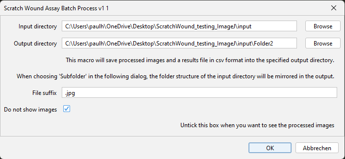
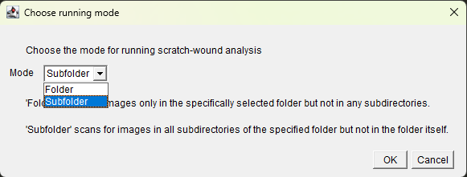
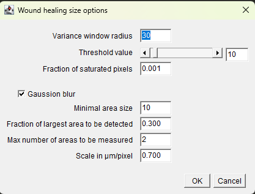
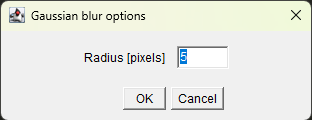
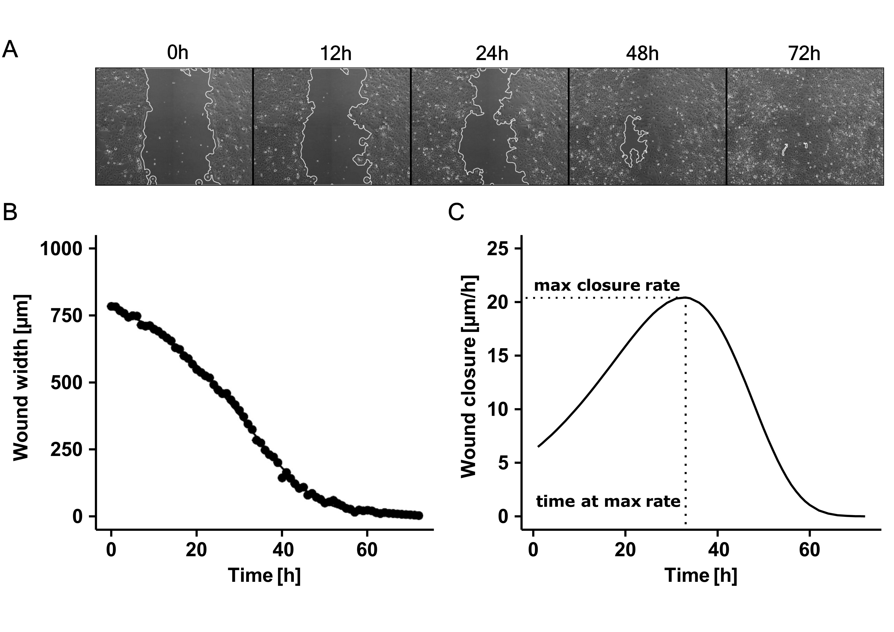

# Batched analysis of scratch wound assays
This repository contains ImageJ code for analyzing scratch wound assays. The analysis involves an image processing pipeline to measure wound healing response in time-series data. The code is based on the ImageJ plugin published by [@Suarez-Arnedo2020].

## Usage
You can either install the .ijm file as a plugin in Fiji or run it as a macro.

When running the plugin, you will be prompted to add the input and output directories and the file suffix used in the loop function (.jpg by default). If you want to see the image output of the plugin, you can untick the box 'Do not show images'. This is intended for testing different parameters for image processing.



*Figure 1: Selection of input and output directories.*

The plugin provides two batch processing modes: One for processing a single folder and a second one for processing multiple folders in the input directory at once. Please note that the second option will ignore any files in the root input directory.



*Figure 2: Batch processing modes.*

Next, you will be prompted to provide the parameters for image processing. The default settings are a good starting point for most use cases but you will need to adjust these based on the properties of your imaging data.



*Figure 3: Input of image processing parameters.*

Finally, if you ticked the 'Gaussian blur' box, you will need to input the radius for the Gaussian blur filter. Again, this is something you will need to test for your imaging data.



*Figure 4: Input of the radius parameter for Gaussian blur.*

The plugin will process your images and output the results in the specified output directories. The output includes a Results.csv file

## Example
Below is an example of how the output can be used for statistical analysis of scratch wound assays. Panel A shows images as output by the plugin with the cell-free area outlined in white.



*Figure 5: Statistical analysis of scratch wound assays.*

## Citation
If you use this code in your research, please cite the repository as follows:

```
@misc{scratch_wound_analysis,
    author = {Paul Horn},
    title = {An ImageJ plugin for batch processing scratch wound assay imaging data},
    year = {2023},
    publisher = {GitHub},
    journal = {GitHub repository},
    howpublished = {\url{https://github.com/hornp89/scratch_wound_analysis}},
}
```
## References
```
@article{Suarez-Arnedo2020,
    author    = {Suarez-Arnedo, A. and others},
    title     = {An Image J Plugin for the High Throughput Image Analysis of in Vitro Scratch Wound Healing Assays},
    journal   = {PLoS ONE},
    volume    = {15},
    year      = {2020},
    month     = {July},
    doi       = {10.1371/journal.pone.0232565}
}
```
